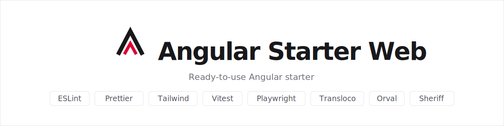

<picture>
  <source media="(prefers-color-scheme: dark)" srcset=".github/assets/banner-dark.svg" />
  
</picture>
<br>
<br>

[](https://github.com/JoanRoucoux/angular-starter-web/actions/workflows/ci.yml)
[](https://angular.dev)
[](LICENSE)
[](https://pnpm.io)

Ready-to-use Angular starter for building a new web application connected to a backend, with every best practice and tool already wired up.

Apps built from this starter are meant to be embedded in a portal that owns the global chrome (header, sidebar, main navigation): the app only renders its body. No integration mechanism is assumed — the app remains a standalone SPA that builds, runs and tests on its own. Language is meant to be driven by the host portal through `LanguageService.setActiveLang()`; the theme follows the OS preference unless the host forces one by setting `data-theme` on `<html>`.

## Stack

| Tool                                                                                                                                                                                   | Role                                                  |
| -------------------------------------------------------------------------------------------------------------------------------------------------------------------------------------- | ----------------------------------------------------- |
| [Angular 22](https://angular.dev)                                                                                                                                                      | Framework (standalone, zoneless, signals)             |
| [Tailwind CSS](https://tailwindcss.com)                                                                                                                                                | Utility-first CSS                                     |
| [ESLint](https://eslint.org) + [angular-eslint](https://github.com/angular-eslint/angular-eslint)                                                                                      | Lint for TypeScript code and templates                |
| [Prettier](https://prettier.io) + [sort-imports](https://github.com/trivago/prettier-plugin-sort-imports) + [tailwindcss](https://github.com/tailwindlabs/prettier-plugin-tailwindcss) | Code formatting, import ordering and class sorting    |
| [Vitest](https://vitest.dev) + [Testing Library](https://testing-library.com/docs/angular-testing-library/intro)                                                                       | Unit tests (Angular's default runner)                 |
| [Playwright](https://playwright.dev)                                                                                                                                                   | End-to-end tests                                      |
| [Transloco](https://jsverse.gitbook.io/transloco)                                                                                                                                      | Internationalization (en/fr, runtime language switch) |
| [Orval](https://orval.dev)                                                                                                                                                             | Generates models and HTTP clients from OpenAPI        |
| [Sheriff](https://sheriff.softarc.io)                                                                                                                                                  | Enforces module boundaries (core/features/shared)     |
| [Husky](https://typicode.github.io/husky) + [lint-staged](https://github.com/lint-staged/lint-staged)                                                                                  | Git hooks (format + lint on commit)                   |
| [commitlint](https://commitlint.js.org)                                                                                                                                                | Commit message validation (Conventional Commits)      |
| GitHub Actions                                                                                                                                                                         | CI: format, lint, tests, build, e2e                   |

The UI component library is not included: plug in the one of your choice.

## Getting started

```bash
pnpm install    # installs dependencies and generates the API clients (postinstall)
pnpm start      # dev server on http://localhost:4200
```

Calls to `/api` are proxied to `http://localhost:8080` by the dev proxy ([proxy.conf.json](proxy.conf.json)): adjust the target to your backend.

## Scripts

| Script                   | Description                                          |
| ------------------------ | ---------------------------------------------------- |
| `pnpm start`             | Dev server (with API proxy)                          |
| `pnpm run build`         | Production build into `dist/`                        |
| `pnpm run build:dev`     | Development build into `dist/`                       |
| `pnpm test`              | Unit tests (Vitest)                                  |
| `pnpm run test:coverage` | Unit tests with coverage report and thresholds       |
| `pnpm run e2e`           | End-to-end tests (Playwright)                        |
| `pnpm run e2e:ui`        | E2e tests in interactive mode                        |
| `pnpm run lint`          | Lint (ESLint)                                        |
| `pnpm run lint:fix`      | Lint with automatic fixes                            |
| `pnpm run format`        | Format the whole project (Prettier)                  |
| `pnpm run format:check`  | Check formatting without modifying anything          |
| `pnpm run generate:api`  | Regenerates clients and models from the OpenAPI spec |

Component tests use [Angular Testing Library](https://testing-library.com/docs/angular-testing-library/intro) (`render`, `screen`, `userEvent`): querying by role or label asserts accessibility for free and matches the Playwright `getByRole` style used in e2e. Services, interceptors and form schemas are tested with plain `TestBed`. The [jest-dom](https://github.com/testing-library/jest-dom) matchers (`toBeInTheDocument`, `toBeEnabled`, ...) are registered in [src/test-setup.ts](src/test-setup.ts).

E2e tests live in `e2e/` (`pages/` for page objects, `fixtures/` for custom test fixtures), next to the app rather than in a separate package.

## Project structure

Based on the [angular-tips](https://angular-tips.dev) recommendations: grouped by business domain, not by technical type.

```txt
src/
├── app/
│   ├── core/                  # Global, non-business-specific features
│   │   ├── api/               # ⚠️ Generated by Orval, do not edit or commit
│   │   ├── i18n/              # Transloco config, LanguageService, page title strategy
│   │   ├── interceptors/      # HTTP interceptors (error handling, ...)
│   │   ├── logger/            # LoggerService (only place allowed to call console)
│   │   ├── models/            # Shared core models (LogLevel, ...)
│   │   └── not-found-page/    # 404 page
│   ├── features/              # Business features, grouped by domain
│   │   ├── home/              # Home page (eagerly loaded)
│   │   │   └── pages/home-page/
│   │   └── users/             # Example of a full feature (lazy loaded)
│   │       ├── pages/         # One folder per page, named <verb>-<entity>-page
│   │       │   ├── browse-users-page/   # User list (rxResource)
│   │       │   ├── create-user-page/    # User creation (signal form)
│   │       │   └── view-user-page/      # User detail (route param + rxResource)
│   │       ├── data/          # In/out calls of the feature (wraps the generated core/api client)
│   │       ├── forms/         # Form models and validation schemas
│   │       └── users.routes.ts
│   └── shared/                # Reusable code
│       ├── forms/             # Generic form helpers (error display, ...)
│       └── testing/           # Test utilities
├── environments/              # Per-environment variables (replaced at build time)
└── styles.css                 # Global styles: Tailwind import + --app-* CSS variables
```

Anatomy of a feature: `pages/` (one folder per page: component + template + spec), `data/` (a service centralizing the feature's in/out calls — pages never import the generated `core/api` client directly), `forms/` (form models and validation schemas, tested on their own), and a routes file. Pages are named `<verb>-<entity>-page` (browse, create, view, ...) and each lives in a folder carrying its full name, matching what `ng generate component` produces. Feature-specific configuration lives in a colocated file (e.g. an `InjectionToken` in `users.config.ts`) when a real need appears; configuration common to all features belongs in `core` or `src/environments`.

Dependency rules, enforced at lint time by [Sheriff](https://sheriff.softarc.io) ([sheriff.config.ts](sheriff.config.ts)): `features` can import `core` and `shared`; `core` can import `shared`; `shared` imports neither `core` nor `features`; features cannot import each other — code shared between features belongs in `core` or `shared`. Modules are barrel-less: import files directly (no `index.ts`), and place files a module wants to keep private in an `internal/` subdirectory.

Available import aliases: `@core/*`, `@features/*`, `@shared/*`, `@environments/*`.

## Talking to the backend

The API contract is described in [openapi/openapi.yaml](openapi/openapi.yaml). TypeScript models and Angular services are generated by Orval into `src/app/core/api` (gitignored, regenerated on every `pnpm install`).

To bootstrap a real project:

1. Replace `openapi/openapi.yaml` with your backend's specification (or point `orval.config.ts` at its URL).
2. Run `pnpm run generate:api`.
3. Wrap the generated services in the feature's `data/` layer, which owns the data/error/loading states with `rxResource`; pages consume ready-made resources:

```ts
// features/users/data/users-api.ts
@Injectable({ providedIn: 'root' })
export class UsersApi {
  #usersService = inject(UsersService); // generated by Orval

  usersResource(): ResourceRef<User[]> {
    return rxResource({
      stream: () => this.#usersService.getUsers(),
      defaultValue: [],
    });
  }
}

// features/users/pages/browse/browse-users-page.ts
export class BrowseUsersPage {
  #usersApi = inject(UsersApi);

  users = this.#usersApi.usersResource();
  // → users.value(), users.error(), users.isLoading(), users.reload()
}
```

HTTP error handling is centralized in `core/interceptors/error-handler-interceptor.ts`: hook up the toast/notification component of your UI library there.

## Internationalization

Translations live in `public/i18n/` (en and fr) and are split in two layers:

- `public/i18n/<lang>.json` — global keys, preloaded before the app renders. Keep it minimal: only cross-cutting keys that must resolve synchronously, such as `pageTitle.*` (the title strategy translates on navigation, before any lazy scope has loaded) and the 404 page.
- `public/i18n/<feature>/<lang>.json` — one [scope](https://jsverse.gitbook.io/transloco/lazy-load/scope-configuration) per feature, declared with `provideTranslocoScope('<feature>')` in the feature's routes and fetched lazily alongside it. Keys are read with the scope as prefix:

```html
<h1>{{ 'users.browse.title' | transloco }}</h1>
```

The language can be switched at runtime via `LanguageService.setActiveLang()` (called by the host portal) and is persisted in a cookie. Page titles are translated and suffixed automatically by `core/i18n/title-strategy.ts`.

## Styling

[Tailwind CSS v4](https://tailwindcss.com) is wired up via PostCSS ([.postcssrc.json](.postcssrc.json)) and imported once in [src/styles.css](src/styles.css) with `@import 'tailwindcss';`. No `tailwind.config.js` is needed for basic usage (Tailwind v4 is CSS-first); use `@theme` in `styles.css` to customize tokens if needed. Component-level styles still use `.scss` (see the `home-page.html` template for an example combining both).

## Quality and conventions

- **On commit**: lint-staged formats and lints the staged files; commitlint enforces [Conventional Commits](https://www.conventionalcommits.org) (`feat: ...`, `fix: ...`, ...).
- **In CI** ([.github/workflows/ci.yml](.github/workflows/ci.yml)): format check, lint, unit tests, build and e2e on every push/PR.
- **Code conventions**: see [angular-tips](https://angular-tips.dev) and the [Angular style guide](https://angular.dev/style-guide). In short: standalone components (`OnPush` change detection is the Angular default since v22, no need to declare it), signals (`input()`, `computed()`, `rxResource`), `inject()`, private `#` properties, control flow (`@if`, `@for`), no `.component`/`.service` suffix in file names, pages suffixed with `-page`.
- **Config files** use ESM `.mjs` where the tool supports it: [eslint.config.mjs](eslint.config.mjs), [prettier.config.mjs](prettier.config.mjs), [commitlint.config.mjs](commitlint.config.mjs).

## Environments

`src/environments/environment.ts` holds local development values and is replaced at build time by `environment.production.ts` (see `fileReplacements` in [angular.json](angular.json)). Always import `@environments/environment`, never a specific file.

## Contributing

See [CONTRIBUTING.md](.github/CONTRIBUTING.md) for the contribution workflow and [CODE_OF_CONDUCT.md](.github/CODE_OF_CONDUCT.md) for community guidelines. To report a vulnerability, see [SECURITY.md](.github/SECURITY.md).

## License

This project is licensed under [MIT](LICENSE).
