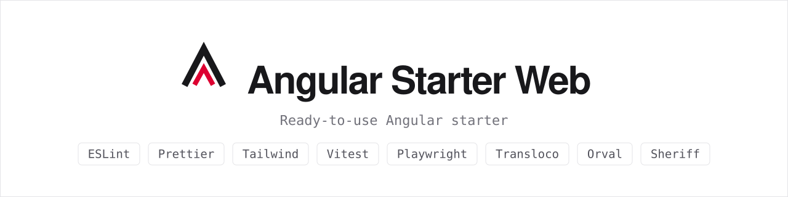

<picture>
  <source media="(prefers-color-scheme: dark)" srcset=".github/assets/banner-dark.svg" />
  
</picture>
<br>
<br>

[](https://github.com/JoanRoucoux/angular-starter-web/actions/workflows/ci.yml)
[](https://angular.dev)
[](LICENSE)
[](https://pnpm.io)

Ready-to-use Angular starter for building a new web application connected to a backend, with every best practice and tool already wired up.

The app ships no global chrome (header, sidebar, navigation): it renders only its body, so it can be embedded in a host shell as-is, or run standalone. No integration mechanism is assumed — it builds, runs and tests on its own either way.

## Stack

| Tool                                                                                                                                                                                   | Role                                                  |
| -------------------------------------------------------------------------------------------------------------------------------------------------------------------------------------- | ----------------------------------------------------- |
| [Angular 22](https://angular.dev)                                                                                                                                                      | Framework (standalone, zoneless, signals)             |
| [Tailwind CSS](https://tailwindcss.com)                                                                                                                                                | Utility-first CSS                                     |
| [ESLint](https://eslint.org) + [angular-eslint](https://github.com/angular-eslint/angular-eslint)                                                                                      | Lint for TypeScript code and templates                |
| [Prettier](https://prettier.io) + [sort-imports](https://github.com/trivago/prettier-plugin-sort-imports) + [tailwindcss](https://github.com/tailwindlabs/prettier-plugin-tailwindcss) | Code formatting, import ordering and class sorting    |
| [Vitest](https://vitest.dev) + [Testing Library](https://testing-library.com/docs/angular-testing-library/intro)                                                                       | Unit tests (Angular's default runner)                 |
| [Playwright](https://playwright.dev)                                                                                                                                                   | End-to-end tests                                      |
| [axe](https://github.com/dequelabs/axe-core-npm)                                                                                                                                       | Accessibility audit run inside the e2e suite          |
| [Transloco](https://jsverse.gitbook.io/transloco)                                                                                                                                      | Internationalization (en/fr, runtime language switch) |
| [Orval](https://orval.dev)                                                                                                                                                             | Generates models and HTTP clients from OpenAPI        |
| [Sheriff](https://sheriff.softarc.io)                                                                                                                                                  | Enforces module boundaries (core/features/shared)     |
| [Husky](https://typicode.github.io/husky) + [lint-staged](https://github.com/lint-staged/lint-staged)                                                                                  | Git hooks (format + lint on commit)                   |
| [commitlint](https://commitlint.js.org)                                                                                                                                                | Commit message validation (Conventional Commits)      |
| [GitHub Actions](https://github.com/features/actions)                                                                                                                                  | CI: format, lint, tests, build, e2e                   |
| [Docker](https://www.docker.com) + [nginx](https://nginx.org)                                                                                                                          | Production image: multi-stage build served by nginx   |

> [!NOTE]
> The UI component library is not included: plug in the one of your choice.

## Getting started

```bash
pnpm install    # installs dependencies and generates the API clients (postinstall)
pnpm start      # dev server on http://localhost:4200
```

Calls to `/api` are proxied to `http://localhost:8080` by the dev proxy ([proxy.conf.json](proxy.conf.json)): adjust the target to your backend.

## Scripts

| Script                   | Description                                          |
| ------------------------ | ---------------------------------------------------- |
| `pnpm start`             | Dev server (with API proxy)                          |
| `pnpm run build`         | Production build into `dist/`                        |
| `pnpm run build:dev`     | Development build into `dist/`                       |
| `pnpm test`              | Unit tests (Vitest)                                  |
| `pnpm run test:coverage` | Unit tests with coverage report and thresholds       |
| `pnpm run e2e`           | End-to-end tests (Playwright)                        |
| `pnpm run e2e:ui`        | E2e tests in interactive mode                        |
| `pnpm run lint`          | Lint (ESLint)                                        |
| `pnpm run lint:fix`      | Lint with automatic fixes                            |
| `pnpm run format`        | Format the whole project (Prettier)                  |
| `pnpm run format:check`  | Check formatting without modifying anything          |
| `pnpm run generate:api`  | Regenerates clients and models from the OpenAPI spec |

Component tests use [Angular Testing Library](https://testing-library.com/docs/angular-testing-library/intro) (`render`, `screen`, `userEvent`): querying by role or label asserts accessibility for free and matches the Playwright `getByRole` style used in e2e. Stores, interceptors and form schemas are tested with plain `TestBed`, without rendering a template. The [jest-dom](https://github.com/testing-library/jest-dom) matchers (`toBeInTheDocument`, `toBeEnabled`, ...) are registered in [src/test-setup.ts](src/test-setup.ts).

E2e tests live in `e2e/` (`pages/` for page objects, `fixtures/` for custom test fixtures), next to the app rather than in a separate package. They also run [axe](https://github.com/dequelabs/axe-core-npm) on the rendered page through `expectNoAccessibilityViolations`, which fails on any WCAG 2.1 A/AA violation — call it again once a dialog is open, since axe only sees what is currently rendered.

Coverage counts **every** source file, not only the ones a spec imports: `coverageInclude` in [angular.json](angular.json) is what makes an untested file report as uncovered instead of disappearing from the report. `coverageExclude` holds the generated client and the pure wiring (bootstrap, `*-routes.ts`, `*-provider.ts`, environments).

## Project structure

Based on the [Angular style guide](https://angular.dev/style-guide) recommendations: grouped by business domain, not by technical type.

```txt
src/
├── app/
│   ├── core/                  # Global, non-business-specific features
│   │   ├── api-client/        # ⚠️ Generated by Orval, do not edit or commit
│   │   ├── i18n/              # Transloco config, LanguageStore, page title strategy
│   │   ├── interceptors/      # HTTP interceptors (error handling, ...)
│   │   ├── logger/            # Logger + LogLevel (only place allowed to call console)
│   │   ├── session/           # SessionStore: what the current user is allowed to do
│   │   └── not-found-page/    # 404 page
│   ├── features/              # Business features, grouped by domain
│   │   ├── home/              # Single-screen feature
│   │   │   ├── home-page.ts   # No screen folder: the page sits at the root
│   │   │   └── home-routes.ts # Every feature owns one, even with a single screen
│   │   └── users/             # Example of a full feature (lazy loaded, behind an access guard)
│   │       ├── list/          # Page + route-scoped store, and delete-dialog/ with its own
│   │       ├── detail/        # Page + store reading the route parameter
│   │       ├── create/        # Page + store + its signal form
│   │       ├── users-access-guard.ts   # canMatch: redirects when the session says no
│   │       └── users-routes.ts         # The feature's public API: paths, titles, scope, guard
│   └── shared/                # Reusable code
│       ├── forms/             # Generic form helpers (error display, ...)
│       └── testing/           # Test utilities
├── environments/              # Per-environment variables (replaced at build time)
└── styles.css                 # Global styles: Tailwind import + --app-* CSS variables
```

Anatomy of a feature: one folder per screen named after its route segment (`list/`, `detail/`, `create/`), plus a `<feature>-routes.ts`. A screen folder holds everything that serves only that screen — page, store, form, dialogs — and **the folder carries the short name while the files carry the full one**: `users/list/user-list-page.ts`, class `UserListPage`. A single-screen feature keeps its page at the root (`home/home-page.ts`). The routes file is the feature's public API: [app-routes.ts](src/app/app-routes.ts) imports nothing else from it, so a feature moves to another app by moving its folder.

A page never injects the API client: any I/O lives in a `<screen>-store.ts` beside it, provided by the route so it is created and destroyed with the screen — see [users-routes.ts](src/app/features/users/users-routes.ts). [AGENTS.md](AGENTS.md) holds the complete set of rules: where each kind of file goes, how state is scoped, and the recipe for adding a screen.

Dependency rules, enforced at lint time by [Sheriff](https://sheriff.softarc.io) ([sheriff.config.ts](sheriff.config.ts)): `features` can import `core` and `shared`; `core` can import `shared`; `shared` imports neither `core` nor `features`; features cannot import each other — code shared between features belongs in `core` or `shared`. Modules are barrel-less: import files directly (no `index.ts`), and place files a module wants to keep private in an `internal/` subdirectory.

Available import aliases: `@core/*`, `@features/*`, `@shared/*`, `@environments/*`.

## Talking to the backend

The API contract is described in [openapi/openapi.yaml](openapi/openapi.yaml). TypeScript models and Angular services are generated by Orval into `src/app/core/api-client` (gitignored, regenerated on every `pnpm install`).

To bootstrap a real project:

1. Replace `openapi/openapi.yaml` with your backend's specification (or point `orval.config.ts` at its URL).
2. Run `pnpm run generate:api`.
3. Inject the generated client into the screen's store — never into the page. There is no hand-written pass-through layer: the generated client already is the data-access layer, and the tests mock HTTP, not the service.

```ts
// features/users/list/user-list-store.ts — provided by the route, not in root
@Injectable()
export class UserListStore {
  #usersApiClient = inject(UsersService); // the generated client

  readonly search = signal('');
  readonly users = rxResource({
    stream: () => this.#usersApiClient.getUsers(),
    defaultValue: [],
  });
  // → users.value(), users.error(), users.isLoading(), users.reload()

  readonly filteredUsers = computed(() => /* ... */);
}

// features/users/list/user-list-page.ts — the page is left with the rendering
export class UserListPage {
  #store = inject(UserListStore);

  protected readonly users = this.#store.users;
  protected readonly filteredUsers = this.#store.filteredUsers;
  protected readonly search = this.#store.search;
}
```

Add a hand-written `<feature>-repository.ts` at the feature root only when it earns its place: aggregating several calls into one business operation, mapping DTOs to a view model shared by several pages, or absorbing an API quirk you do not want to spread.

HTTP error handling is centralized in `core/interceptors/error-handler-interceptor.ts`: hook up the toast/notification component of your UI library there.

Access control follows the same path: [core/session/session-store.ts](src/app/core/session/session-store.ts) asks the backend once what the current user may do, and each feature keeps its own decision in a `<feature>-access-guard.ts` mounted on its routes file — see [users-access-guard.ts](src/app/features/users/users-access-guard.ts).

## Internationalization

Translations live in `public/i18n/` (en and fr) and are split in two layers:

- `public/i18n/<lang>.json` — global keys, preloaded before the app renders. Keep it minimal: only cross-cutting keys that must resolve synchronously, such as `pageTitle.*` (the title strategy translates on navigation, before any lazy scope has loaded) and the 404 page.
- `public/i18n/<feature>/<lang>.json` — one [scope](https://jsverse.gitbook.io/transloco/lazy-load/scope-configuration) per feature, declared with `provideTranslocoScope('<feature>')` in the feature's routes and fetched lazily alongside it. Keys are read with the scope as prefix:

```html
<h1>{{ 'users.list.title' | transloco }}</h1>
```

The language can be switched at runtime via `LanguageStore.setActiveLang()` — by the app itself, or by a host shell embedding it — and is persisted in a cookie. Page titles are translated and suffixed automatically by `core/i18n/title-strategy.ts`.

## Styling

[Tailwind CSS v4](https://tailwindcss.com) is wired up via PostCSS ([.postcssrc.json](.postcssrc.json)) and imported once in [src/styles.css](src/styles.css) with `@import 'tailwindcss';`. No `tailwind.config.js` is needed for basic usage (Tailwind v4 is CSS-first); use `@theme` in `styles.css` to customize tokens if needed. Components carry no stylesheet of their own — utilities in the template and `@theme` tokens cover it — but nothing prevents adding a `styleUrl` if one ever needs it. The active color scheme follows the OS preference, unless a host shell forces one by setting `data-theme` on `<html>`.

## Quality and conventions

- **On commit**: lint-staged formats and lints the staged files; commitlint enforces [Conventional Commits](https://www.conventionalcommits.org) (`feat: ...`, `fix: ...`, ...).
- **In CI** ([.github/workflows/ci.yml](.github/workflows/ci.yml)): format check, lint, unit tests, build and e2e on every push/PR, plus a `generate` job that scaffolds an app from the working tree and runs its own gates, so the generator manifest and templates cannot drift.
- **Code conventions**: signals, `inject()`, `#` private fields, control flow (`@if`, `@for`), no `.component`/`.service` suffix, classes named after their role rather than their Angular type, pages suffixed with `-page`. `OnPush` is Angular 22's default and is never declared. The full list lives in [AGENTS.md](AGENTS.md), next to the [Angular style guide](https://angular.dev/style-guide).
- **Config files** use ESM `.mjs` where the tool supports it: [eslint.config.mjs](eslint.config.mjs), [prettier.config.mjs](prettier.config.mjs), [commitlint.config.mjs](commitlint.config.mjs).

## Environments

`src/environments/environment.ts` holds local development values and is replaced at build time by `environment.production.ts` (see `fileReplacements` in [angular.json](angular.json)). Always import `@environments/environment`, never a specific file.

## Deployment

[Dockerfile](Dockerfile) builds the production image in two stages: Node installs the dependencies, generates the API client and builds the app; [nginx](nginx.conf) serves the result on port 80.

```bash
docker build -t my-app .
docker run --rm -p 8080:80 my-app
```

The nginx config does the two things a single-page app needs: unmatched paths fall back to `index.html` so a refresh on `/users/1` still works, and `index.html` is never cached while the hashed asset filenames are. Calls to `/api` are **not** proxied there — [proxy.conf.json](proxy.conf.json) is a dev-server concern only. In production a host shell or an ingress routes them; add a `location /api` to [nginx.conf](nginx.conf) if the container has to reach the backend itself.

## Contributing

See [CONTRIBUTING.md](.github/CONTRIBUTING.md) for the contribution workflow and [CODE_OF_CONDUCT.md](.github/CODE_OF_CONDUCT.md) for community guidelines. To report a vulnerability, see [SECURITY.md](.github/SECURITY.md).

## License

This project is licensed under [MIT](LICENSE).
